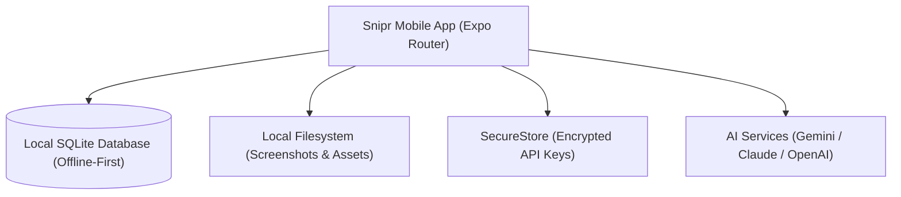

# Snipr AI — Mobile Snippet Vault 🚀

<div align="center">
  <p><strong>Your offline-first, AI-powered developer knowledge vault for iOS & Android.</strong></p>

  [](https://expo.dev/)
  [](https://reactnative.dev/)
  [](https://sqlite.org/)
  [](https://www.typescriptlang.org/)
  [](https://deepmind.google/technologies/gemini/)
</div>

---

## 🌟 Overview

**Snipr AI** is an offline-first developer companion application engineered for mobile systems. It allows developers to capture, categorize, view, optimize, and organize reusable code snippets and configurations directly on their devices. 

By integrating a local SQL engine, intelligent AI providers, a dynamic sandboxed file export workflow, and a camera/gallery-based OCR code extractor, Snipr AI delivers a frictionless personal developer vault that operates seamlessly without requiring an internet connection.

### 📱 Product Demos & Walkthroughs
* **App Demonstration Clip:** [Watch the Attachment Preview](https://github.com/user-attachments/assets/cb206b13-d9ce-4b5e-96e9-d27f38b408b9)
* **Video Walkthrough (Build, Tech Stack & Design):** [Google Drive Presentation](https://drive.google.com/file/d/1oIBoOHCl1DcQ-mr2_HpKBc8VyKtU0USk/view?usp=sharing)

---

## 🏢 System Architecture

Snipr AI is designed with a lightweight, offline-first structure. The user interface communicates directly with on-device databases and local storage, only hitting external APIs when explicitly generating AI-powered code insights.



---

## ⚡ Product Specifications & Core Modules

### 1. Offline-First Core Storage
* **Synchronous Local Client:** Powered by `expo-sqlite`, executing SQL operations directly in local sandboxes.
* **Migration Lifecycle:** Automatic table bootstrapping and migration schemas managed through [migrations.ts](file:///d:/Mobile%20Dev%20Cohort/Snipr/src/services/db/migrations.ts).
* **Indexed Queries:** Setup with specific database indexes on `language`, `favorite`, `title`, and `created_at` parameters to ensure sub-millisecond sorting and retrieval speeds under heavy datasets.

### 2. Multi-LLM AI Routing Engine
* **Flexible Provider Support:** Native integration with **Google Gemini**, **Anthropic Claude**, and **OpenAI** API models. Details in [aiServices.ts](file:///d:/Mobile%20Dev%20Cohort/Snipr/src/services/ai/aiServices.ts).
* **Structured Output Model:** Leverages JSON schemas to request formatted code explanations, logical steps, complex time/space analytics, and refactored code.
* **Automatic Layout Fallback:** Uses a regex-based markdown parser to render responses seamlessly if the API payload cannot be parsed as structured JSON.
* **Hardware-Level Security:** Stores private developer API keys inside iOS Keychain / Android Keystore using `expo-secure-store`.

### 3. Image OCR Code Scanner
* **Multimodal Scanner:** Converts photos, tutorial screenshots, or scanned images into editable, copyable source code.
* **Direct Integration:** Handles vision inputs and processes extraction inside [CreateSnippetScreen.tsx](file:///d:/Mobile%20Dev%20Cohort/Snipr/src/app/CreateSnippetScreen.tsx), auto-filling the snippet editor workspace instantly.

### 4. Dynamic Sandbox File Management
* **Language-Specific Exports:** Resolves file names and language extensions (e.g. `.ts`, `.py`, `.rs`, `.swift`) dynamically.
* **Asset Copy Pipeline:** Copies picked images from the temporary device folders and copies them permanently inside the sandbox application storage (`Documents/`) for offline viewing.

---

## 💾 Database Schema Spec

The database table structure is optimized to record local snippets, attachments, metadata, and cache AI-generated explanations to eliminate redundant API requests.

### Table: `snippets`
| Field | Type | Modifiers | Description |
| :--- | :--- | :--- | :--- |
| **`id`** | `INTEGER` | `PRIMARY KEY AUTOINCREMENT` | Unique autoincremented identifier. |
| **`title`** | `TEXT` | `NOT NULL` | The name or header of the snippet. |
| **`description`** | `TEXT` | `NULL` | Optional developer explanation or context. |
| **`code`** | `TEXT` | `NOT NULL` | The raw source code of the snippet. |
| **`language`** | `TEXT` | `NOT NULL` | Selected programming language target. |
| **`tags`** | `TEXT` | `NULL` | Comma-separated search tag filters. |
| **`favorite`** | `INTEGER` | `DEFAULT 0` | Flag (`0` or `1`) representingstarred status. |
| **`file_path`** | `TEXT` | `NULL` | On-device sandbox export file path. |
| **`screenshot_path`**| `TEXT` | `NULL` | Permanent local image location. |
| **`ai_summary`** | `TEXT` | `NULL` | 1-sentence descriptor generated by AI. |
| **`ai_explanation`** | `TEXT` | `NULL` | Structured JSON containing logical details. |
| **`ai_improvement`** | `TEXT` | `NULL` | Optimization suggestions in structured JSON. |
| **`ai_improved_code`**| `TEXT` | `NULL` | AI-refactored optimize-ready code snippet. |
| **`created_at`** | `INTEGER` | `NOT NULL` | Unix timestamp of creation date. |
| **`updated_at`** | `INTEGER` | `NOT NULL` | Unix timestamp of update date. |

### Configured Indices
* `idx_language` on `language`
* `idx_favorite` on `favorite`
* `idx_title` on `title`
* `idx_created_at` on `created_at`

---

## 🛠️ Technology Stack

| Technology | Category | Purpose |
| :--- | :--- | :--- |
| **Expo SDK 55** | Framework | Cross-platform build system & routing target |
| **React Native** | Runtime | Native rendering wrapper for iOS & Android |
| **Expo Router** | Routing | Native file-system based router & stacks |
| **Expo SQLite** | Database | Embed local synchronous SQL queries |
| **React Native Reanimated** | UI | Fluid layout transitions, sliding modal menus, and Toast animations |
| **Expo FileSystem** | Filesystem | Sandbox file exports and permanent screenshot storage |
| **Expo Image** | Media | High-performance screenshot caching & rendering |
| **AsyncStorage / SecureStore** | Storage | User settings cache & encrypted key storage |

---

## 🚀 Setup & Run Instructions

### Prerequisites
Ensure you have **Node.js** and **Bun** (or **npm**) installed on your machine.

### 1. Install Dependencies
Run the installation in the project root:
```bash
bun install
# or
npm install
```

### 2. Launch the Development Server
Fire up the Expo CLI compiler:
```bash
bun run start
# or
npm run start
```

Use the terminal key commands to target emulator testing:
* Press **`a`** to load the project on your local Android Emulator.
* Press **`i`** to load the project on your local iOS Simulator.
* Scan the displayed terminal QR code using **Expo Go** on a physical iOS or Android device.

### 3. Reset Local Data (Fresh Mount)
To clean database records, preference keys, and local documents during debugging:
```bash
bun run reset-project
```

---

## 🗺️ Roadmap & Planned Additions
- **☁️ Turso Cloud Sync:** Sync local SQLite databases to cloud databases when networks reconnect.
- **🔍 AI Semantic Search:** Screen to search snippets based on meaning and concepts.
- **🔍 Web Portal:** A web client synced via Turso Cloud, ensuring snippets are accessible from any browser.
